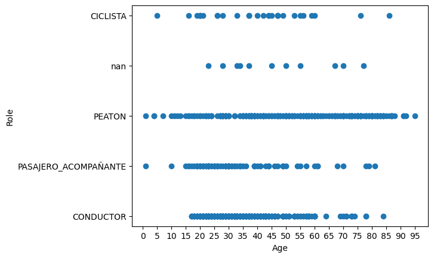
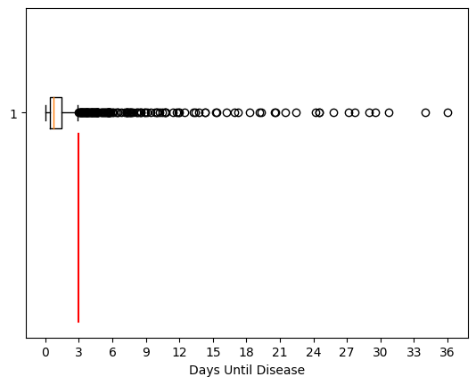

# Data Analytics Integrator Project

In this project we will follow the guidelines presented in the following repository: <https://github.com/soyHenry/PI_DA>.

## 0 - Project Summary

The primary aim of the Data Analytics Integrator Project is to provide Henry students with hands-on experience in the field of data analytics by engaging them in addressing a real-world issue. This particular challenge involves the analysis of a dataset pertaining to homicides resulting from road accidents in the city of Buenos Aires spanning the years 2016 to 2021.

## 1 - Project Objectives

The general objectives of the project can be outlined as follows:

- Generate useful information for local authorities to take actions in order to reduce the amount of fatal victims in road accidents.
- Using an exploratory data analysis (EDA), identify anomalies or curious trends in the road accidents that lead to fatalities.
- Propose, measure, plot and analyse different KPIs.
- Develop an interactive dashboard for a comprehensive storytelling of the data.

## 2 - Audience Identification

The audience of this project are the Henry Mentors that are going to evaluate it. For them, the most important part is the information and analysis more than the process or coding to get there. Hence, the whole results will be focused on the former.

## 3 - Report of Dashboard Analysis

### 3.1 - Data General Description

In the figures below, general descriptions of the homicide and victims data can be seen, respectively.

**Homicides Data**

**Victims Data**

In general terms, one may draw the following observations:

- The number of victims is generally 1, this can be seen because the mean is very close to 1 and the standard deviation is close to 0.
- The maximum number of victims is 3, this happened in the accident with `ID=2017-0035`.
- Approximately 13% of homicides occur at `COMUNA=1`, this is high considering there are 16 communes.
- The mean and standard deviation of the coordinates make sense, since we are talking of a city.
- Approximately 42% of homicides occur at motorcycle accidents, which makes sence but is concerning.
- Approximately 76% of victims are men, this is also concerning.
- Victims go from newborns (1 year) to 95 year old people. Accidents don't judge by the age.
- The mean hours until disease is around 55 hours (2 days and 7 hours), however, the median is 18 hours. This means there is a lot of outliers that pull the mean, however, most of the victims die in less than a day.

### 3.2 - Unusual Trends Found in the Data

#### 3.2.1 - Victim Types
This is not really an unusual trend but it is in fact something authorities must be regulating more to prevent fatal accidents. As seen in the figure below, motorcycles and pedestrians represent together the greather part of the victim types.

Authorities must look into this cases and make legislation so that motorcycle drivers can have safer practices and gear while driving. Additionally, pedestrian fatalities can also be prevented with transportation manners education and more street signs.

#### 3.2.2 - Accused Types
This for me does represent an important statistic for authorities to look into. Figure below represents the vehicle type accused of causing the fatal accident. In this case, the most concerning piece of information is the high number of accidents that are due to cargo or passenger vehicles. The thing is that generally, drivers of this type of vehicles are hired and working, and must be professional in their job. However, it is common that this professional drivers are not very patient and drive very recklessly, which is probably why they cause so many accidents.

Authorities must look into this cases and make legislation so that drivers recieve more training and probably a more scrupulous hiring process. All this can prevent most of these accidents.

#### 3.2.3 - Temporal Distribution by Months
In general, this statistic is also not a surprise but very important to look into. In the figure below, the temporal distribution of fatal accidents is presented grouped by each of the months in the six years of the data. There are two interesting details about this plot. First, the fact that during the pandemic, the fatal accidents dropped circumstantially, this is just an important detail to confirm the data accuracy with respect to real World situations. Second, the fact that in the last month of the years, fatal accidents tend to increase, this is probalby due to the festivities.

Authorities must look into this cases and make legislation so that drivers are more responsible during the festivities.

#### 3.2.4 - Fatalities Distribution by Sex
This statistic can be alarming at plain sight but a further analysis leads to this being a normal result. In the figure below, the percentage of male and female fatalities is presented. The fact that male fatalities is more than three times the amount of female fatalities can be alarming at first. But, on a further analysis, a dataset on demographics of driver's licences since 2006 was found [here](https://www.estadisticaciudad.gob.ar/eyc/?p=29210). From here, we can see that the proportion of males to females that have a driver's licence in Buenos Aires is around 71:29 also, hence, the percentages shown in the figure below are normal because there are more men exposed to accidents that women.

The importance of this analysis is to never jump into conclusions without considering all the variables that yield a result.

#### 3.2.5 - Relation between Age and Role in a Fatal Accident
The objective of this plot is to show how many drivers of high ages are involved in fatal accidents. In the figure below you can see a scatter plot relating the role of the victim on the accident and the age. The lower part of this plot confirms that there are more drivers within the ages 70-75 causing fatal accidents than the drivers in the 60-65 age range. This is natural because with age, reflects, vision and other abilities are lost.

Authorities must look into this cases and make legislation so that drivers require to pass physical exams periodically so that they can keep driving.

#### 3.2.6 - Days Until Disease Distribution
The objective of this plot is to identify the distribution of the amount of days between the accident and the disease of the victim. See in figure below that in general, victims die on the first day, and the maximum to be considered an normal data point is 3 days. However, we can see lots of outliers, which in this case means that the victim lived for 3 days or more.

#### 3.2.7 - Relating Days Until Disease with other Variables
In the figures below, we can see the relation between days until disease of the victims and variables such as accused of the accident and role of the victim, respectively.

**Accused vs Days Until Disease**

**Role vs Days Until Disease**

From here we can see that accidents with fixed objects, cargo vehicles and multiple vehicles are more violent. It is interesting to see that accidents caused by motorcycles are not that violent as people tend to survive for a few days before departing. Finally, accidents caused by bikes are not that violent, however, when the victim is driving a bike, accidents tend to be violent. Hence, accidents where bikes are involved but not caused by them are very violent.

Authorities must look into this cases and make legislation so that drivers can be educated about how to share the road with bikes, because we can see that this fatal accidents are not fault of the bikes.

#### 3.2.8 - Location Analysys
In the figure below, the puntual locations of fatal accidents in Buenos Aires was generated. Note that maybe accidents are concentrated on the east side of the city, however, this is not an evident grouping and one may say that fatal accidents distribute equitatively arounf the city.

## 4 - KPIs Analysis

#### 4.1 - 

#### 4.2 -

#### 4.3 -

## 5 - Visualization Tool

The interactive tool used for this project was the Python's library Streamlit. This tool can be found here: <https://deployhenrypida.streamlit.app>.